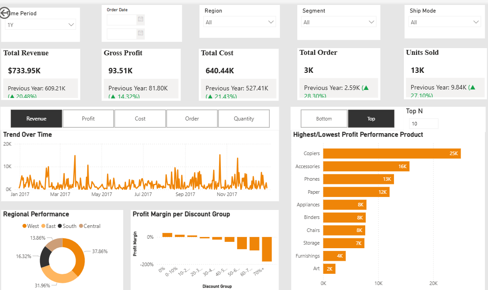

# Supply Chain & Sales Analytics Dashboard

Power BI portfolio project analyzing sales performance, profitability, customer segments, product categories, returns, discounts, and delivery lead time using a retail supply chain dataset.

## Business Questions
- Which categories, regions, and customer segments generate the most sales and profit?
- Which products or sub-categories create margin risk?
- How do discounts affect profitability?
- Which shipping modes create service-level gaps?
- Which salespeople and regions should be prioritized?

## Key Metrics
- **9,994** order-line records
- **$2.30M** total sales
- **$286.4K** total profit
- **12.5%** profit margin
- **8.0%** line-item return rate
- **34.6 days** average shipping lead time

## Most Interesting Insights
- **Technology** leads category performance, generating **$0.84M** in sales and making it a key category for inventory and sales prioritization.
- The **West** region is the strongest profit contributor with **$108.4K**, while the **Central** region has the weakest profit at **$39.7K**.
- High discounts create margin pressure: the **>30%** discount bucket shows the lowest margin at **-48.2%**.
- Loss-making sub-categories such as Tables ($-17.7K), Bookcases ($-3.5K), Supplies ($-1.2K) require pricing, supplier cost, and discount-policy review.
- **Same Day** is the fastest shipping mode at **0.9 days**, while **Standard Class** is slowest at **41.9 days**, supporting logistics SLA recommendations.

## Dashboard Pages
- **Sale**: 18 visuals
- **Supply Chain**: 17 visuals
- **Customer**: 14 visuals

## Tools
Power BI, Power Query, DAX, Excel, Data Modeling, Data Visualization, Business Intelligence

## Description
Built a Power BI dashboard to analyze 9,994+ retail order-line transactions across sales, profit, returns, discounts, customer segments, regional performance, and shipping lead time. Identified category-level profitability drivers, discount-related margin risks, regional performance gaps, and logistics SLA opportunities to support inventory planning, pricing control, and sales strategy.
